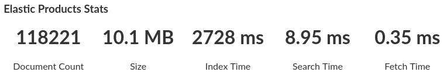

# About

This repository contains an Active Admin component to display Elastic Search statistics for an index. It adds a very simple panel that you can for example include in your dashboard page.



The above screenshot was taken from an Active Admin instance using the `ArcticAdmin` theme, so it will look different for instances that use the default theme.

# Installation

Add `gem 'active_admin-elastic_stats'` to your Gemfile and execute `bundle`.

In your Active Admin page add the component through the Arbre builder method `active_admin_elastic_stats(model)`:

```ruby
ActiveAdmin.register_page 'Dashboard' do
  content title: proc { I18n.t('active_admin.dashboard') } do
    columns do
      column { active_admin_elastic_stats(Product) }
      column { active_admin_elastic_stats(Supplier) }
    end
  end
end
```

We expect the model that is supplied to `active_admin_elastic_stats` to include `Elasticsearch::Model`.
